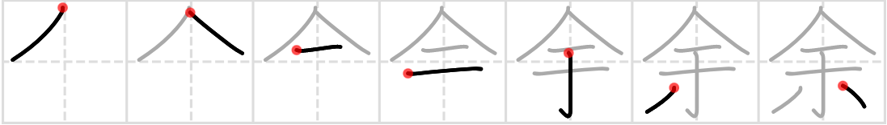

## 余

## too much, myself, surplus, other, remainder

- Jōyō kanji, taught in grade 5
- JLPT level N3
- 680 of 2500 most used kanji in newspapers

## On : ヨ
+ 余 【ヨ】 other, another, remaining, leftover, over, more than, I, me
+ 余韻 【ヨイン】 reverberation, swelling (of a hymn), trailing note, lingering memory, aftertaste, suggestiveness (of a book, poem, etc.)
+ 残余 【ザンヨ】 remainder, the rest, residue
+ 窮余 【キュウヨ】 extremity, desperation

## Kun : あま.る、 あま.り、 あま.す、 あんま.り

+ 余る 【あまる】 to remain, to be left over, to be in excess, to be too many
+ 余り 【あまり】 remainder, remnant, rest, balance, surplus, remains (of a meal), leftovers, (not) very, (not) much, too much, excessively, overly, extreme, great, severe, tremendous, terrible, more than, over
+ 余りに 【あまりに】 too (much), overly, excessively
+ 余す 【あます】 to save, to leave over, to spare
+ 余すところなく 【あますところなく】 fully, thoroughly
+ [余り 【あまり】](../AdverbN3/amari.md) remainder, remnant, rest, balance, surplus, remains (of a meal), leftovers, (not) very, (not) much, too much, excessively, overly, extreme, great, severe, tremendous, terrible, more than, over
+ [余りに 【あまりに】](../AdverbN3/amarinimo.md) too (much), overly, excessively

[https://jisho.org](https://jisho.org/search/%E4%BD%99%20%23kanji)