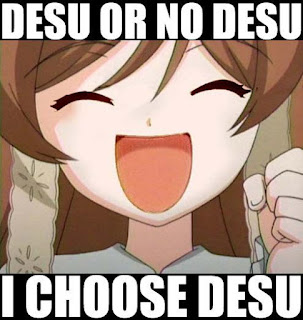
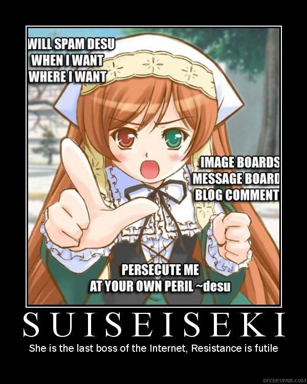

# です・ます vs だ・である style（文体）

**Objective:** Find out the difference in writing style.

Japanese writing can be divided into two major styles, often called:

+ です・ます style and
+ だ・である style.

です shows engagement with social rules and therefore directs the writing specifically toward the reader.

The だ・である style can be equated with that of だ in speaking, though its impact varies dramatically according to the level of formality. This fits in with the idea that だ is "raw" and can therefore be used to show naked emotions and bare facts alike, without the sense of social etiquette that is part and parcel of です・ます style.

If we delve a little deeper, だ・である style can also be broken down further into two distinct styles. With impeccable logic, these two styles are known as だ style and—you guessed it—である style. They are often treated as one and the same because they come under the umbrella of だ for self-expression, implying a lack of focus on the audience.

When we make だ statements, we are stepping away from the need to perform in a socially calculated way, and instead we emphasize our personal thoughts and feelings. In other words, だ statements allow us to avoid considering our relative social status compared to our listeners' because the statement is conceptually staying inside our personal space. In the safety of our bubble, だ statements do not necessarily require a response. This enables us to devote all of our attention to self-expression.

When it comes to actual writing styles, however, だ style and である style are usually considered separate as they carry different nuances. To put it simply, だ is plain and である is a bit more authoritative and formal.

For that reason, だ style is usually referred to as plain style, and である style is referred to variously in textbooks as plain-formal, literary, or expository style. です・ます style remains one set, referred to as polite style.

## Examples of nuances:

### だ FOR EMPHATIC SELF-EXPRESSION

Statements that end in だ can be used to express thoughts and feelings that arise suddenly or powerfully within us. These kinds of statements are self-directed, and thus we can imagine that they remain inside our personal space bubbles when we say them. Contrary to what you may have learned in textbooks, だ is commonly used to express your inner state when speaking in the presence of someone to whom you'd usually use a more polite speech style like です and ます. This is because your use of だ communicates that the purpose of the statement is self-expression and not actually directed at the listener, even if they are within earshot.

### だ FOR SOUNDING THE ALARM

There are some cases where it is not clear whether a だ statement should be considered self-directed or directed at others. For these examples, we think it is useful to imagine that the speaker's personal space bubble has expanded to include the listeners inside of it.
火事だ！

### だ FOR INVADING PERSONAL SPACE

When だ statements that carry a negative emotion or message are directed at a specific listener, だ adds an aggressive and assertive feeling. In this case, the listener may feel surprised, affronted, or threatened by the statement. For this reason, we refer to this use of だ as "invasive."
うそだ！
While this statement is clearly motivated by the actions of a particular person, the use of だ suggests that the statement is not intended to engage the listener in discussion. While it is directed at the speaker in the sense that it is intended to have an impact, it is stripped of all feelings of social responsibility or concern for the other person's point of view. The purpose is to express the speaker's outrage, not to start a conversation. The one-sided nature of this statement is what gives it an assertive, or even confrontational, feeling.

### だ IN CASUAL CONVERSATION

While the uses of だ we've discussed thus far seem to be directed at the speaker themselves, there are also cases where we use だ statements that are clearly directed at others. In these cases, だ is used because the listener is considered close enough to the speaker that their relative social statuses are not relevant or worth paying attention to by using です. Perhaps you are speaking to a friend, family member, or a friendly first-name-basis type of acquaintance. In these cases, we can imagine that the speaker and listener's personal space bubbles overlap like a Venn diagram, and an entire conversation can take place within their shared personal space.

When だ is used in casual conversations, it is frequently paired with conversational particles like よ and ね. Remember that when だ is used alone it can convey a feeling of strong emotion? Well, our particle friends help to make the statement sound softer and more interactional.

A: 明日テストだよ。(Hey, we have an exam tomorrow.)

B: え！？( What!?)

A: 今日は徹夜だね。(It's gonna be an all-nighter for you.)

For example, by saying 明日テストだよ, you are reminding the listener of the test. If this is stated without the particle よ, this would sound more like a だ statement intended to express the speaker's sudden remembrance of the test. Similarly, saying 徹夜だね allows the speaker to show her empathy while suggesting the listener should study all night. Without the ね, this sentence would sound more like a strong command.

### です FOR CREATING DISTANCE

using です increases the distance between people, which results in their relationship feeling more formal. です is part of the "polite speech style" in Japanese, along with the ます form of verbs. This stands in opposition to the "casual speech style," which だ is considered to be a part of.

Imagine that you are talking with your senpai at work. He might offer you permission to use タメ口. The word タメ口 consists of ため (equal) and くち (mouth), and is pronounced as ためぐち. As the word suggests, using it indicates that the speaker and listener have equal status. If someone asks you to use タメ口　　ぐち, it is likely that the person wants to be friends with you. Or タメ口 can also be a sign of romantic interest.

### です FOR EMPHASIZING SARCASM

When doing this with someone who is usually in your personal space bubble, the listener will feel ejected from the bubble, which can have a comedic, sarcastic effect but can also be perceived as rude or hurtful. Let's explore how this works in real life situations. Imagine a situation where you have a boyfriend who is bragging about getting a whole lot of chocolates from his colleagues on Valentine's Day. Instead of using your energy to complain about his lack of sensitivity, you can say the following sentence, keeping the tone of your voice low for effect.
へー、良かったですねー。
Saying this in a casual speech form would still communicate your true thoughts, which is that you're not happy about what he told you, if you manipulate the tone of your voice and facial expressions to show sarcasm. But the addition of です, makes your boyfriend feel you are creating distance between the two of you, and this makes your statement sound even colder. Remember, です emphasizes distance and creates certain nuances only when you use it with someone who you normally talk to in casual speech style.

### です FOR STEPPING INTO A DIFFERENT SOCIAL ROLE

Another way this distance affects our communication is that it allows speakers to step into a different social role. For example, teachers use polite speech style to address the whole class when talking about something that is relevant to everyone. When they talk to a specific student about something that is relevant only to that student, they are more likely to use casual speech. This is because what they say is more or less personal when they address particular students. When they address the whole class however, teachers tend to use です to show that they are now engaged in a social activity they are responsible for. In other words, teachers use です to signal that their focus is on the class, and they are well aware of their role as a teacher.

## ACADEMIC WRITING

である style is overwhelmingly employed in academic writing, particul arly in published research papers, theses, and dissertations. This is because the information under discussion is objective, rigorous, and intended to be persuasive, making the authoritative and formal tone of である fitting in this kind of writing. The である style can have a high-and-mighty connotation, so its use as base form is generally limited. So the choice of writing style is more about the text's content and intended audience. である style is often used when the text is issued by some sort of authority, whereas plain old だ style is for more neutral and lighter texts. Lighter academic writing exercises such as high school essays, on the other hand, tend to use だ style instead. Official documents, such as government reports and policy documents, are also primarily written in である style. です・ます style is often associated with simple, easy-to-read instructions or guidelines addressing the reader directly. So even in formal writing, if information is portrayed as being directed toward the reader, です・ます style will almost always be favored.

## NEWS MEDIA

The purpose of news media is to convey information in a purely objective manner without the sense that this information carries authority. Here, だ style is usually preferred over である style to reflect the ideal that journalists should maintain a neutral voice in their writing, rather than trying to persuade the reader of their point of view. In editorials and other pieces that are addressing the reader directly, です・ます style can be used. Other styles, including である or very casual styles, can also be mixed in strategically to spice up writing and convey various nuances and different personas. Not all news media outlets follow these general principles, however. While most online newspapers use だ style for fact reporting, NHK News Web has opted for です・ます style. There are two possible reasons for this choice. Unlike newspapers, NHK doesn't have a print edition, and so it doesn't have to work within a limited space. That means they can freely address readers directly and politely by using です・ます to make their articles more accessible and sound friendly. Another explanation could be that NHK is first and foremost a broadcaster, which might have influenced their choice of a more "spoken" style.

## CREATIVE WRITING

Creative writers tend to select one style as the prominent voice in their writing. However, they can intentionally mix in other styles to add different effects.

The following is an excerpt from Banana Yoshimoto's critically acclaimed novel, Kitchen.

しんと暗く、なにも息づいていない。見慣れていたはずのすべてのものが、まるでそっぽをむいているではないですか。私はただいまと言うよりはお邪魔しますと告げて抜き足で入りたくなる。
Cold and dark, not a sigh to be heard. Everything there, which should have been so familiar, seemed to be turning away from me. I entered gingerly, on tiptoe, feeling as though I should ask permission. (Translation by Megan Backus.)

Yoshimoto mainly uses だ style in this novel, but she switches to です style in the second sentence to make the reader feel as though the character is stepping out of the story momentarily to directly address the reader. This adds a feeling of sudden interaction with the reader, which is nearly impossible to reflect in the English translation.

Authors use these style-mixing techniques in a range of creative writing genres, from essays and editorials to advertisements and newspaper columns. Even in expository writing such as textbooks, guide books, or blog posts, you may notice that style mixing is used to make the writing more impactful and engaging.

## SOCIAL MEDIA POSTS

In fact, most native Japanese speakers use style mixture to some extent, and social media posts are a great example of this.
昨日撮ったツツジの写真です

満開の花はやっぱりきれいだー
Here's a picture of a rhododendron that I took yesterday. Flowers in full bloom really are beautiful!

The first sentence introduces the topic and tells the account's followers what is in the attached picture. Then, in the second sentence, the style switches to casual to express the writer's inner thoughts, admiring the beauty of the flowers in full bloom.

Social media posts are often loaded with style mixing, as people can freely weave their thoughts in a message to their followers.

|| です・ます体  | だ体 |である体 |
|| --- | --- | --- |
|| (はがき、てがみ) | (日記) |(レポート、研究計画書、論文)|
|**名詞**| 学生です | 学生だ |学生である |
|**な形容詞**|	学生ではありません|	学生ではない||	 
| 	|学生でした|	学生だった|	学生であった|
| 	|学生ではありませんでした|	学生ではなかった||	 
|**い形容詞**	|大きいです	|大きい||	 
| 	|大きくないです|	大きくない||	 
| 	|大きかったです|	大きかった|	| 
| 	|大きくなかったです|	大きくなかった||	 
|**動詞**  	|書きます|	書く||	 
| 	       |書きません	|書かない|   |	 
| 	        |書きました	|書いた|	 |
| 	        |書きませんでした|	書かなかった||	 
|**そのほかの、気をつける形**||||			
|   	|説明しましょう|説明しよう||	 
| 	|必要でしょう	|必要だろう	|必要であろう|
| 	|問題なのです	|問題なのだ	|問題なのである|
| 	|教えてください	|教えてほしい||	 

Basic concepts of です as socially-oriented and だ as self-oriented have remained consistent throughout. The effect that these concepts have on communication can vary depending on context, but underneath it all, their basic meaning remains the same. If the message is self-directed and your main purpose is expressing your thoughts or feelings, then だ is your ticket. If your message is directed toward others and you intend to present information in a socially aware manner, then です is probably preferred.

Based on [Tofugo blogpost](https://www.tofugu.com/japanese/da-vs-desu-in-real-life/)

