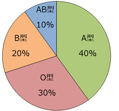
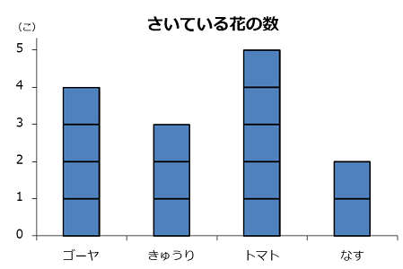
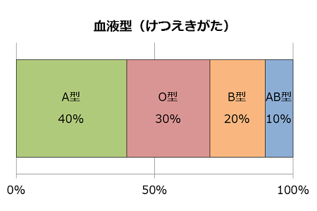
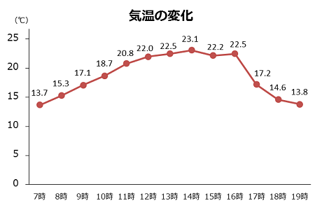

## グラフの種類
|種類||
| --- | --- |
|円グラフ||
|棒グラフ||
|帯グラフ||
|折れ線グラフ||

## グラフで使う言葉

縦軸、横軸　　　　～をとる 
点線、実線　斜線　黒い・白い部分　細かい・粗い　～を・について表す　　示す 
複数回答　　割合　　～を占める 
増える・増加する　減る・減少する　　上がる　　　下がる 
差が開く　　　差が縮まる　　～ている　　～てきた　　～ていく 
～を上回る　　　～下回る　　少しずつ　　徐々に　　急に　　大きく　　少し 
 

## グラフの説明

このグラフは＿＿＿＿＿を表しています・示しています。 
縦軸に＿＿＿＿＿がとってあります。 
横軸に＿＿＿＿＿を表しています。 
単位は＿＿＿＿＿です。 
＿＿＿を見ると、＿＿＿＿が＿＿＿＿＿となっています。 
＿＿＿＿と＿＿＿＿を比べると、＿＿＿＿＿＿です。 
＿＿＿＿が＿＿＿＿のに比べて、＿＿＿＿は＿＿です。 
＿＿＿＿です。これに対して、＿＿＿＿＿です。 
このグラフから＿＿＿＿＿ということがわかります・いえます・読み取れます。 
＿＿＿＿は　増加・減少　傾向にある。  
＿＿＿＿が＿＿＿に上っている・達している。 
＿＿＿＿が＿＿＿を超えている。