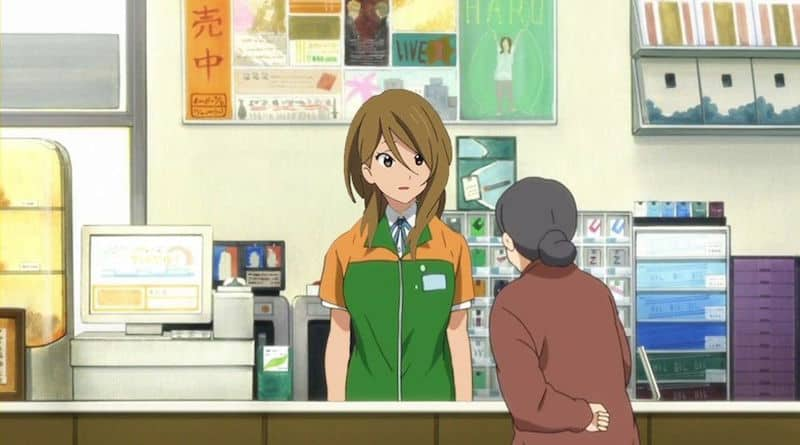
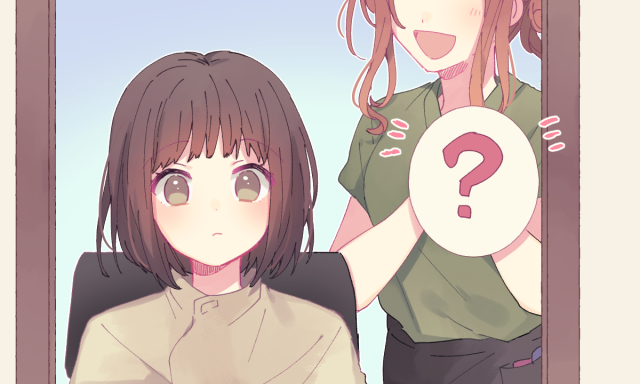
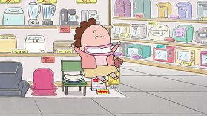
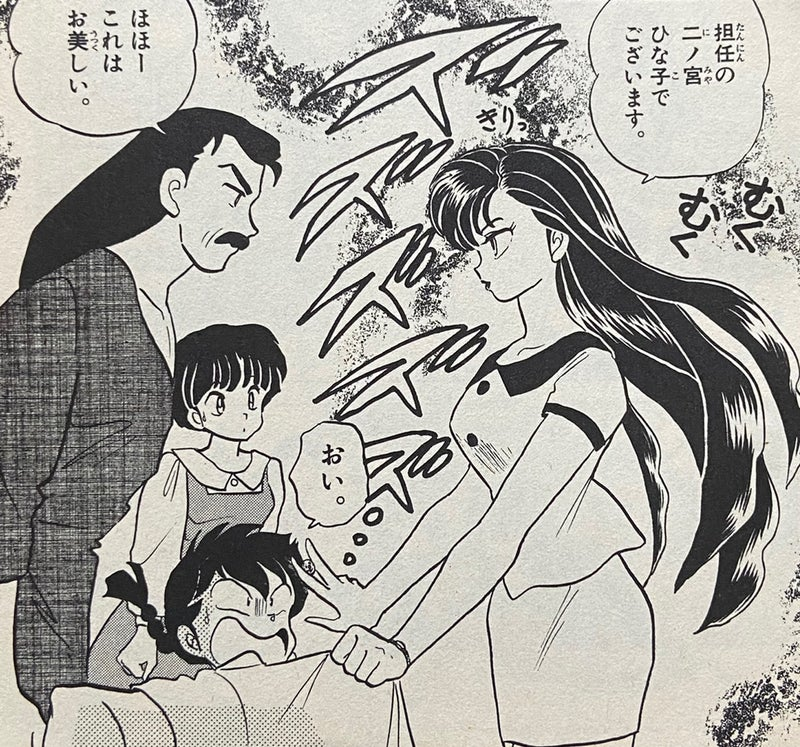
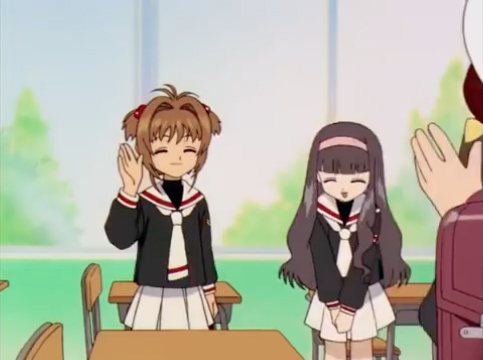

客さん(Y)

お店の人(C)

## コンビニ

（レジで）

C: いらっしゃいませ。お箸お付けいたしますか。

Y: いえ、大丈夫です。

C: たしこまりました。袋にお入れしますか。

Y: はい、お願いします。あのう、Rポイントが使えますか。

C: はい、お使えいただけます。こちらにお番号をいれください。
レシートはご必要でしょうか。

Y: あ、いえ、結構です。

C: ありがとうごさいました。

## ヘアサロン

（サロンに入ったところ）

C: いらっしゃいませ。ご予約のお名前を伺いしてもよろしいですか。

Y: ＊＊です。

C: お待ちしておりました。こちらのいすにおかけになってください。
もしよろしければ、こちらのお雑誌をご覧になって、お待ちになって下さい。

Y: あのう、トイレをつかいたいんですが。

C: はい、あちらにございますので、お使いください。

Y: わかりました。ありがとうございます。

## ホテルの受付

C: いらっしゃいませ。チェックインでよろしいですか。

Y: はい。一泊二日でお願いしている（名前）です。

C: （名前）様でいらっしゃいますね。お待ちしておりました。
もし分けございませんが、こちらのシートのお名前をお書きください。

Y: （名前を書く）

C: お部屋のカードキーでございます。ご夕食は、一階の食堂でお召し上がりになってください。
Wi/fiのパスワードはこちらにございますので、ご覧になって下さい。

Y: はい、わかりました。

C: それでは、お部屋までご案内いたします。

## デパート

Y: あのう、すみません。食品売り場はどこにありますか。

C: ４階にございます。
あそこにエレベーターがございますので、それをご利用くださいませ。

Y: わかりました。ありがとうございます。

（エレベーターの中で）

C: ドアが閉まりますので、どうぞご注意くださいませ。
また、この度は<ruby>上<rt>じょう</rt>層<rt>そう</rt>階<rt>かい</rt></ruby>にお上がりになるのでございますね。
お客さんは、何階までご利用になりますか。

Y: ４階です。

C: 了解いたしました。

## Making a visit

<ruby>訪<rt>ほう</rt>問<rt>もん</rt></ruby>する

A:お<ruby>招<rt>まね</rt></ruby>きいただき、ありがとうございます。 
B:はい。あ、田中さんですね。はじめまして。 
A:はじめまして。田中と申します。よろしくおねがいします。 
B:主人がいつもお世話になっております。 
A:こちらこそ、いつもありがとうございます。これからもよろしくおねがいします。 
B:どうぞお上がりください。 
C:あ、いらっしゃい。田中くん。 
A:こしらつまらないものですが。どうぞおかけ取りください。 
C:え・・・ありがとうございます。どうぞおかけください。 
A:おじゃまいたします。 
A:素晴らしいお料理ですね。全て奥様のお手製なのでしょうか。 
B:ええ。田中さんがいらっしゃるって聞いていたから、たくさん料理を作りましたよ。遠慮しないで召し上がってください。 

### 例文

1.  A:もう８時ですね。そろそろ失礼いたします。 
    B:またいらっしゃってください。
2.  A:ごめんください。 
    B:あ、田中さん、いらっしゃい。はじめまして。金子の妻です。 
    A:はじめまして。田中です。 
    　いつもおせわになっております。 
    B:どうぞお上がりください。 
    A:あるがとうございます。失礼します。 
    　あの、つまらないものですが、どうぞおかけ取りください。 
    B:まあ、ごていねいに恐れ入ります。  
3. 昼食を準備いたしました。どうぞ召し上がってください。
4. ご意見がありましたら、どうぞおしゃってください。
5. 金曜日の晩に、うちでパーティーをします。先生もどうぞいらっしゃってください。
6. これから寒くなりますので、どうぞお体を大事になさってください。
7. A:今朝の新聞をもうお読みになりましたか。 
   B:いや、まだ読んでない。 
   A:こちらです。どうぞご覧ください。
8. 毎晩だいたい何時にお休みになりますか。

## Simple Greetings

A:おはよう。 
B:あ、おはようございます・・・・部長、お疲れですね。昨日は何時にお帰りになりましたか。 
A:え？あ、終電だったよ。今日の加藤さんとの打ち合わせが、昨日急に決まったんだって。だから資料を準備しないとならなかったんだ。 
B:大変ですね・・・あのー、よろしかったらお手伝いします。資料をまとめて印刷いたしましょうか。 
A:あ、じゃあ、後で資料を渡すから、よろしく。 
B:はい！ 
A:ありがとう。助かるよ。 

### よく使われるあいさつ

||ですますスタイル|友達スタイル|
| --- | --- | --- |
|朝|おはようございます|おはよう|
|会社から 帰るとき|A:それでは、お先に失礼します・いたします。 B:お疲れ様です。|A:じゃ、お先に！ B:お疲れ様|
|お礼|A:ありがとうございます。 B:こちらこそ・どういたしまして。|A:ありがとう。 B:大丈夫だよ。|
|天気|A:いいお天気ですね。・暑いですね。・（雨が）よく降りますね。 B:そうですね。|A:いい天気だね。・暑いね・よく降るね。 B:そうだね。|
|別れるとき|A:失礼します。・失礼いたします B:お気をつけて。・それではまた（<ruby>明<rt>あ</rt>日<rt>す</rt></ruby>お目にかかります）。|A:じゃあね。 B:気をつけてね。・じゃ、また（あした）。|

### 例文

来週の東京への出張のことですが、空港までお迎えに参りますので、到着される時間をお知らせください。空港で資料をお渡ししますので、車の中でご覧ください。ご昼食のあと、会議の場所までお送りします。どうぞよろしくお願いいたします。

新しいパソコンの使い方について、私からご説明いたします。

お送りくださったメールは、私が拝見しました。

駅の前で先生にお会いしました。

忙しいですね。お手伝いしましょうか。

（あなたの国の有名な観光地で、写真を撮ろうとしている日本人を見て）お撮りしましょうか。

## Offering An Invitation

A:部長、ちょっとよろしいでしょうか。 
B:何？ 
A:再来週の日曜日、なにかご予定がありますか。 
B:日曜日・・・・どうして？何かあるの？ 
A:もうすぐ海外に転勤する人がいるので、送別会をしようと思っているんです。 部長もご一緒にいかがかと思いまして・・・。 
B:おお、いいね！行きたいな。お菓子か何か買っていったほうがいい？ 
A:いえいえ、お気遣いなく。では、またご連絡します。楽しみにしております。 

### 例文

1. Address someone：声をかける

    部長、すみません。 
    いま、よろしいですか。・ちょっとよろしいでしょうか。 
    今、お時間いただけますか。 

2. Ask about someone's plans
    
    日曜日は、なにかご予定がありますか。 
    来週の火曜日、小林さんのご都合はいかがでしょうか。

3. Offer an Invitation
    
    + 部長にもぜひ来ていただきたいんですが・・・。（強く誘うときはこの表現を使い） 
    + 部長にもご出席いただけないかとおもいまして。 
    「〜まして」は「〜ます」のて形。「〜ので」と同じ意味。書くときは使いません。 
    + よろしかたら、部長もいらっしゃいませんか。 
    + よろしければ、部長もいかがでしょうか。 
    + もしご都合がよろしければ、部長もいかがかとおもいまして・・・。 

4. 「ご遠慮無く」　　「お・ご〜なく」＝「〜ないでください」
    
    「ご心配なく」「お気遣いなく」「おかまいなく」など <s>「ご心配なくてね」</s> 
    A:私もパーティーに行っていいでしょうか。 
    B:もちろん。どうぞご遠慮無く。 
    A:飲み物などを買っていきましょうか。 
    B:いえいえ。私が用意しますから、お気遣いなく。 

    すべての同士には使えないので注意！
    <s>「お書きなく」</s>　　<s>「お話しなく」</s>

5. 「〜ております」　　＝「〜ています」の謙譲語
    
    お返事をお待ちしております。 
    当日お会いできるのを楽しみにしております。 
    大学で日本映画を研究しております。  

6. 「〜でしょうか」
   
    コーヒーはお好きでしょうか。 
    明日はお忙しいでしょうか。 
    ご都合はいかがでしょうか。 
    いつがよろしいでしょうか。 

7. 「〜ていただきたいんですが」
   
    先生にも来ていただきたいんですが・・・。 
    ぜひ、パーティーに出席していただきたいんですが・・・。 
    先生にも、是非参加していただきたいんですが・・・。 

8. 「〜もいかがかとおもいまして」
   
    この映画、ご一緒に田中さんもいかがかと思いまして・・・。

