## 初めまして

The first thing that you must say in a self-introduction or <ruby>自<rt>じ</rt>己<rt>こ</rt>紹<rt>しょう</rt>介<rt>かい</rt></ruby> is: 

<ruby>初<rt>はじ</rt></ruby>めまして

The set phrase hajimemashite <ruby>初<rt>はじ</rt></ruby>めまして either comes from the verb hajimeru 始める, which means "to start," or it's a shortened form of <ruby>初<rt>はじ</rt></ruby>めてお<ruby>目<rt>め</rt></ruby>にかかりまして. Though etymologists aren't sure of the word's true origin, hajimemashite implies beginning or doing something for the first time. Most people think of it as saying "How do you do?" or "Nice to meet you."

## 名前

For a formal situation, you should say both your first and last names. In a casual situation, it's common to say only your family name for Japanese people.

私は name と<ruby>申<rt>もう</rt></ruby>します。

と<ruby>申<rt>もう</rt></ruby>します　- One meaning of the verb 申す is "to be called." It's paired with the particle と and conjugated to 申します。 
This is a polite phrase, so it's safe to use in almost any situation.

|エチケット|例文|訳|
| --- | --- | --- |
|Casual|私の名前はマイケルですが、みんなにはマイクって呼ばれています。|My name is Michael, but most people call me Mike.|
|Polite|マイケルといいます。|I'm Michael.|
|Polite|マイケルです。|I'm Michael.|
|Very Formal|マイケルと申します。|I'm Michael.|
|Very Formal/Business|Microsoftのマイケルと申します。|I'm Michael from Microsoft.|

## 出身

<ruby>出<rt>しゅっ</rt>身<rt>しん</rt></ruby> means "person's origin" and refers more to the place you were born or grew up than where you currently live. It's often used for specific places like a city, state, or prefecture, rather than a country. For example, Mami was born in Osaka, and now lives in Canada. But she spent most of her life in Nara, so she says " <ruby>奈<rt>な</rt>良<rt>ら</rt>県<rt>けん</rt></ruby>の<ruby>出<rt>しゅっ</rt>身<rt>しん</rt></ruby>です。" or " 出身は奈良県です。"

The verb mairu <ruby>参<rt>まい</rt></ruby>る is a more humble form of kuru 来る or iku 行く. So when 参る is used to talk about where you came from in "アメリカから参りました," it's much more humble, so use it in appropriate situations.

## 仕事

Some of these jikoshoukai example sentences use the continuous state conjugation of suru する which is shiteimasu しています. If you want to get extra polite with any of these sentences, swap out しています with shiteorimasu しております. One easy switch and you're ready to tell CEOs and presidents about your work situation.

|例|訳|
| --- | --- |
|...に<ruby>勤<rt>つと</rt><ruby>めています。|I'm working for...|
|...で <ruby>働<rt>はたら</rt></ruby>いています。|I'm working at...|
|私は会社員です。|I'm an office worker.|
|トヨタで<ruby>営<rt>えい</rt>業<rt>ぎょう</rt></ruby>を<ruby>担<rt>たん</rt>当<rt>とう</rt></ruby>しています。|I'm working in sales at Toyota.|
|NYTimesで<ruby>編<rt>へん</rt>集<rt>しゅう</rt>長<rt>ちょう</rt>をしています。|I'm the chief editor of NYTimes.|

## 性格

### 血液型

性格分析に使った<ruby>血<rt>けつ</rt>液<rt>えき</rt>型<rt>がた</rt></ruby>の特性

|血液型| 性格の特性|
|--- | --- |
|A型|　<ruby>真<rt></rt>面<rt></rt>目<rt></rt></ruby>、<ruby>神<rt>しん</rt>経<rt>けい</rt>質<rt>しつ</rt></ruby> - nervous、<ruby>几<rt>き</rt>帳<rt>ちょう</rt>面<rt>めん</rt></ruby>　- methodical|
|B型|　<ruby>明<rt></rt></ruby>るい、マイペース、<ruby>自<rt>じ</rt>己<rt>こ</rt>中<rt>ちゅう</rt>心<rt>しん</rt>的<rt>てき</rt></ruby> - selfish|
|O型|　<ruby>楽<rt>らく</rt>天<rt>てん</rt>的<rt>てき</rt></ruby>　- optimistic、おおらか - calm​、<ruby>大<rt>おお</rt>雑<rt>ざっ</rt>把<rt>ぱ</rt></ruby> - careless|
|AB型|　<ruby>天<rt>てん</rt>才<rt>さい</rt>肌<rt>はだ</rt></ruby> - seeming like a genius、性格が理解されにくい、<ruby>二<rt>に</rt>重<rt>じゅう</rt>人<rt>じん</rt>格<rt>かく</rt></ruby> - dual personality|

### 星座

|黄金聖闘士|||
| ------ | ------ |------ |
|
 <ruby>牡<rt>お</rt>羊<rt>ひつじ</rt></ruby>座  Aries - ３月21日～４月19日
 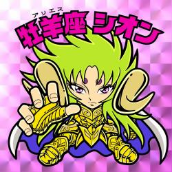|
<ruby>牡<rt>お</rt>牛<rt>うし</rt></ruby>座 Taurus - ４月20日～５月20日
 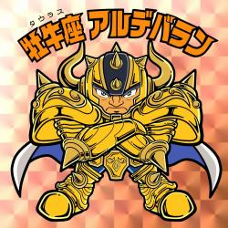|
<ruby>双<rt>ふた</rt>子<rt>ご</rt></ruby>座 Gemini - ５月21日～６月21日
 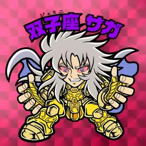|
|
<ruby>蟹<rt>かに</rt></ruby>座 Cancer - ６月22日～７月22日
 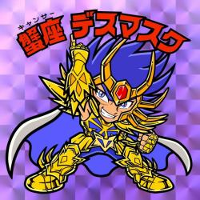|
<ruby>獅<rt>し</rt>子<rt>し</rt></ruby>座 Leo - ７月23日～８月23日
 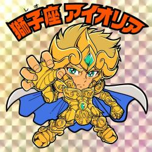|
<ruby>乙<rt>おと</rt>女<rt>め</rt></ruby>座 Virgo - ８月23日～９月22日
 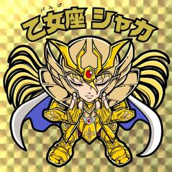|
|
<ruby>天<rt>てん</rt>秤<rt>びん</rt></ruby>座 Libra - ９月22日～１０月23日
 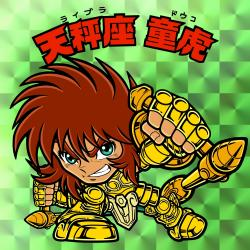|
<ruby>蠍<rt>さそり</rt></ruby>座 Scorpio - １０月23日～１１月21日
 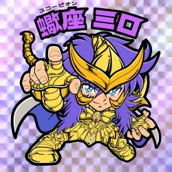|
<ruby>射<rt>い</rt>手<rt>て</rt></ruby>座 Sagittarius - １１月22日～１２月21日
 |
|
<ruby>山<rt>や</rt>羊<rt>ぎ</rt></ruby>座 Capricorn - １２月21日～１月20日
 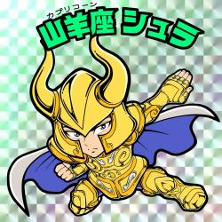|
<ruby>水<rt>みず</rt>瓶<rt>がめ</rt></ruby>座 Aquarius - １月21日～２月20日
 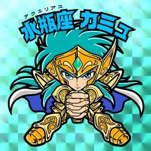|
<ruby>魚<rt>うお</rt></ruby>座 Pisces - ２月21日～３月20日
 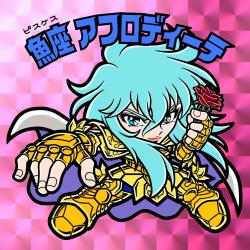|

## はまっていること

「最近<ruby>熱<rt>ねっ</rt>中<rt>ちゅう</rt></ruby>していること/ハマっていること」

まずは、熱中していることからその人の興味関心を知りたいと考えています。

**日常生活で「熱中している瞬間」を<ruby>掘<rt>ほ</rt>り</ruby><ruby>下<rt>さ</rt>げる</ruby>**

日常生活の小さなことに<ruby>着<rt>ちゃく</rt>目<rt>もく</rt></ruby>してみると、「熱中している<ruby>瞬<rt>しゅん</rt>間<rt>かん</rt></ruby>」を見つけられるでしょう。普段、生活していくなかで、下記のような瞬間を書き出してみましょう。

+ 集中している
+ 楽しいと感じている
+ 面白いなと感じる

書き出した内容を、「どれくらいの頻度でおこなっているのか」「なぜ楽しい・面白いと感じるのか」など考えてみてください。この内容をまとめれば、熱中していることの回答が作成できるでしょう。

**自分の「好き・嫌い」を<ruby>素<rt>す</rt>直<rt>なお</rt></ruby>に書き出す**

自分の興味関心を知るために、まずは素直に自分の気持ちを書き出して、それを分析することが必要です。好きなことと嫌いなことを書き出して、それがなぜ好きなのか・嫌いなのかを考えてみましょう。

何気なく好きだなと感じていることが、実は熱中できるものの可能性もあります。また、嫌いなことを知ることで、自分の興味関心が何かをきちんと知ることができますよ。

**熱中していることの例**

1. 学業
   
    学生の本業は勉強です。熱中していることで、学業を伝えるのもおすすめですよ。大学の勉強はもちろん、それ以外にも勉強していることがあればそれを伝えると、入社後も必要な知識を積極的に勉強するという勤勉・努力家なイメージにもなるでしょう。例: ゼミの研究、語学勉強、世界遺産検定、ITパスポート、TOEIC、ビジネス書を読む、プログラミング。

    彼女はフランス語の習得に熱中している。She intents on mastering French.

    彼は研究に熱中している。He is deep in study.

2. <ruby>趣<rt>しゅ</rt>味<rt>み</rt></ruby>
   
    熱中していることの質問はあなたの興味関心を知るためのものなので、趣味を伝えるのも良いですよ。面接官と趣味が合って盛り上がることができれば、その後の面接も有利に進む可能性もあります。ただし、どうしても印象が悪くなってしまう可能性のある趣味もあるので、それらは避けてくださいね。 例: 旅行・読書・歌うこと・映画鑑賞・音楽鑑賞・スポーツ観戦・野球／ゴルフ／テニス／サッカー等・料理・将棋・キャンプ・美術館巡り

    彼女は今テニスに熱中している。She is now absorbed in tennis.

3. 学外活動・課外活動
   
    学外活動や課外活動にはさまざまなものがあります。大学生活以外にも、力を注いでいることがあれば高い評価を得られる可能性があります。なぜなら、積極的に物事に挑戦する姿勢や、企画力・実行力・行動力などがあると考えられるからです。例: アルバイト・ボランティア・インターンシップ・Wスクール・サークル・留学・委員会・部活動

**熱中していることの作り方3ステップ**

**①熱中していることを<ruby>簡<rt>かん</rt>潔<rt>けつ</rt></ruby>に述べる**

結論から述べるのは、わかりやすい文章にするための鉄則です。まずは、熱中していることを始めに簡潔に述べてください。併せて、どれくらい熱中しているのかも伝えると、面接官はよりイメージしやすいでしょう。
    
    熱中していることの冒頭の例:

        + パン屋のアルバイトで、新商品の開発に熱中しています。
        + 2年ぶりの大学祭の実現のために、一年間大学祭運営委員会の活動に熱中しています。
        + 美術館巡りに熱中していて、毎週2か所は美術館に通っています。

**➁なぜ熱中しているのかを伝える**
   
   理由がなければ説得力がありません。なんとなく好きなことではなく、熱中しているということは、理由や興味を持ったきっかけがあるはずです。ここが抜けてしまうと、回答に説得力が欠けてしまい「適当に話しているのか」と思われて印象は悪くなってしまいます。そのため、きちんと理由を述べられる内容を選ぶことも大切ですね。固有名詞を使うなど具体的に話すことで、より熱中していることに信ぴょう性のある回答になります。

**③熱中していることから学んだことを伝える**
   
   どんなことでも熱中して時間を費やしたのであれば、少なくとも1つは学びがあるはずです。熱中している時間のなかでの気づきや考え方の変化、新しい知識の取得など、学びの種類はさまざまあるので、下記のような視点で学んだことをいくつか書き出してみてください。

Based on [webpost](https://careerpark-agent.jp/column/35390)

## よろしく

The final piece of the puzzle is よろしくお願いします. It doesn't translate well to English. In a self-intro situation, it means something like "Please be kind to me." It's often translated as "Nice to meet you." This isn't technically correct, though it carries a similar feeling.

|エチケット|例文|
| --- | --- |
|Casual|よろしく。 どうぞよろしく。|
|Polite|よろしくお願します。|
|Polite/Business|どうぞ、よろしくお願いします。 よろしくお願い致します。|
|Very Polite/Business|どうぞ、よろしくお願い致します。|
|Formal/Business|よろしくお願い申し上げます。|
|Very Formal/Business|どうぞ、よろしくお願い申し上げます。|

Based on [Tofugu post](https://www.tofugu.com/japanese/jikoshoukai/)