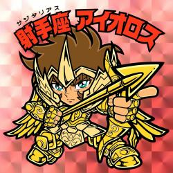

## 自己紹介

## 名前

## 出身しゅっしん

## 仕事しごと

## 血液型

性格分析に使った血液型の特性

|血液型| 性格の特性|
|--- | --- |
|A型|　真面目、神経質しんけいしつ　nervous、几帳面きちょうめん　methodical|
|B型|　明るい、マイペース、自己中心的じこちゅうしんてき　selfish|
|O型|　楽天的らくてんてき　optimistic、おおらかcalm​、大雑把おおざっぱcareless|
|AB型|　天才肌てんさいはだseeming like a genius、性格が理解されにくい、二重人格にじゅうじんかくdual personality|

## 星座

|黄金聖闘士|||
| ------ | ------ |------ |
|
 <ruby>牡<rt>お</rt>羊<rt>ひつじ</rt></ruby>座  Aries - ３月21日～４月19日
 |
<ruby>牡<rt>お</rt>牛<rt>うし</rt></ruby>座 Taurus - ４月20日～５月20日
 |
<ruby>双<rt>ふた</rt>子<rt>ご</rt></ruby>座 Gemini - ５月21日～６月21日
 |
|
<ruby>蟹<rt>かに</rt></ruby>座 Cancer - ６月22日～７月22日
 |
<ruby>獅<rt>し</rt>子<rt>し</rt></ruby>座 Leo - ７月23日～８月23日
 |
<ruby>乙<rt>おと</rt>女<rt>め</rt></ruby>座 Virgo - ８月23日～９月22日
 |
|
<ruby>天<rt>てん</rt>秤<rt>びん</rt></ruby>座 Libra - ９月22日～１０月23日
 |
<ruby>蠍<rt>さそり</rt></ruby>座 Scorpio - １０月23日～１１月21日
 |
<ruby>射<rt>い</rt>手<rt>て</rt></ruby>座 Sagittarius - １１月22日～１２月21日
 |
|
<ruby>山<rt>や</rt>羊<rt>ぎ</rt></ruby>座 Capricorn - １２月21日～１月20日
 |
<ruby>水<rt>みず</rt>瓶<rt>がめ</rt></ruby>座 Aquarius - １月21日～２月20日
 |
<ruby>魚<rt>うお</rt></ruby>座 Pisces - ２月21日～３月20日
 |

## 性格

## はまっていること

## 将来のこと：夢、抱負ほうふ、など。

## 会話クラブに参加する目的

## 日本語を学ぶきっかけ